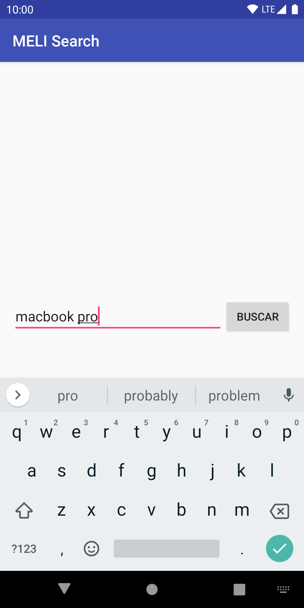
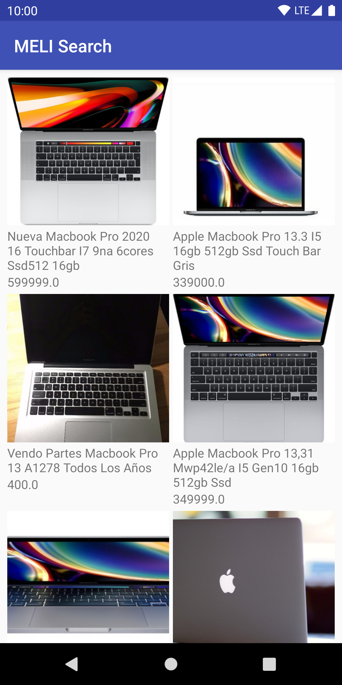
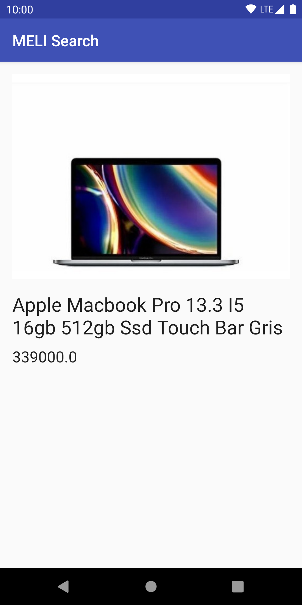

# android-meli-challenge
Android app developed in Kotlin that consumes Mercado Libre search API.

Check the challenge specification [here](extras/meli_mobile_challenge.pdf).

Search Screen | Overview Screen | Details Screen
--- | --- | ---
 |  | 
